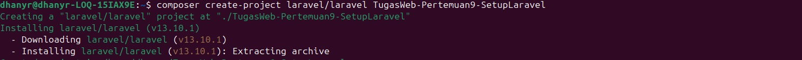
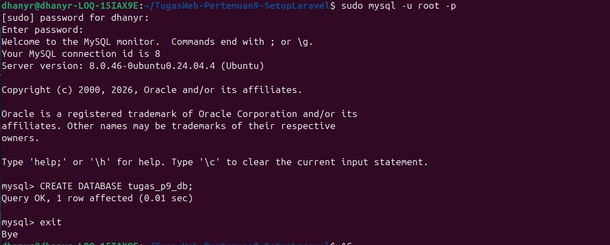
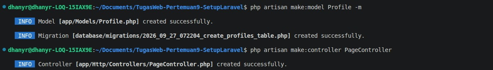
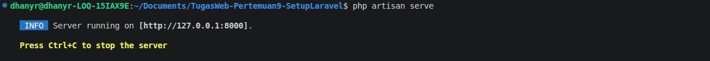
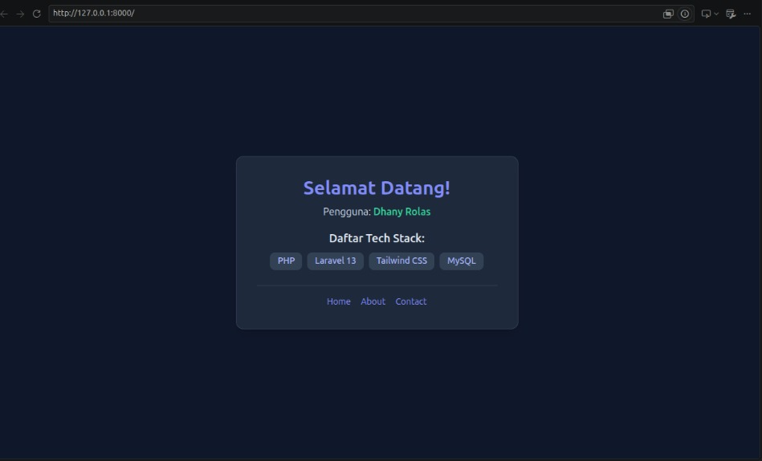

# TugasWeb-P9-LaravelSetup

Repositori ini dibuat untuk memenuhi **Tugas Rutin 9 — Setup Laravel** pada mata kuliah Pemrograman Web. Proyek ini berisi instalasi awal framework Laravel 13, integrasi database MySQL, penggunaan Model, Migration, Controller, hingga penyajian data dinamis melalui Blade Templating dengan styling Tailwind CSS CDN.

---

## 🛠️ Ringkasan Pengerjaan & Fitur (Requirements Completed)

- [x] **Requirement 1**: Instalasi proyek Laravel baru (`TugasWeb-P9-LaravelSetup`) menggunakan Composer[cite: 1, 2].
- [x] **Requirement 2**: Pembuatan database MySQL (`tugas_p9_db`) dan konfigurasi file `.env`[cite: 1, 2].
- [x] **Requirement 3**: Development server berjalan (`php artisan serve`) & verifikasi halaman welcome[cite: 1, 2].
- [x] **Requirement 4**: Pendaftaran 3 custom route (`/`, `/about`, `/contact`) mengembalikan Blade View[cite: 1, 2].
- [x] **Requirement 5**: Mengirim dan menampilkan data dinamis (array) dari Controller ke View Blade[cite: 1, 2].
- [x] **Requirement 6**: Pembuatan Model `Profile` beserta Migration (`php artisan make:model Profile -m`) dan Controller `PageController` (`php artisan make:controller PageController`)[cite: 1, 2].
- [x] **Requirement 7**: Penulisan dokumentasi `README.md` lengkap terkait langkah setup dan struktur folder[cite: 1].
- [x] **Requirement 8 & Bonus**: Styling UI menarik menggunakan Tailwind CSS CDN serta penambahan Route Parameter (`/hello/{nama}`)[cite: 1].

---

Dokumentasi & Tangkapan Layar (Screenshots)
1. Instalasi Composer & Setup Proyek Laravel
Proyek diinisialisasi menggunakan Composer versi terbaru dengan arsitektur Laravel 13 (PHP 8.3+). Pengelolaan dependensi ditangani secara deklaratif melalui

2. Tampilan Halaman Welcome Page (Tailwind CSS)
Halaman awal (Welcome Screen) aplikasi Laravel yang telah terkompilasi dengan antarmuka responsif Tailwind CSS:

3. Konfigurasi Environment & Pembuatan Database MySQL
Proses pembuatan database tugas_p9_db pada server MySQL lokal:

4. Penggunaan Artisan Code Generator (Model & Controller)
Bukti eksekusi generator Artisan CLI untuk membuat Model Profile beserta Migration dan Controller PageController:

5. Menjalankan Server Pengembangan Lokal
Menjalankan HTTP server internal bawaan Laravel:

(Tampilan UI Browser)

Rincian Fitur Bonus
1. Styling UI dengan Tailwind CSS CDN
Halaman dirancang menggunakan library Tailwind CSS CDN eksternal untuk menghasilkan tampilan modern berkategori dark mode, komponen kartu terpusat, dan layout fleksibel.

2. Route Parameter Dinamis /hello/{nama}
Fitur bonus kedua mengimplementasikan rute dinamis dengan parameter URL pada routes/web.php:
Route::get('/hello/{nama?}', [PageController::class, 'hello']);
Parameter $nama diterima oleh PageController@hello dan merespon pesan sapaan dinamis secara aman menggunakan fungsi pengaman e().

🚀 Panduan Menjalankan Proyek Secara Lokal
1. Prasyarat SistemPHP: Versi >= 8.2 (dilengkapi ekstensi pdo_mysql, mbstring, xml). 
   Composer: Versi 2.x.   
   MySQL / MariaDB Server.

2. Cloning Repositori
    git clone [https://github.com/dhanyrolas21/TugasWeb-P9-LaravelSetup.git](https://github.com/dhanyrolas21/TugasWeb-P9-LaravelSetup.git)
    cd TugasWeb-P9-LaravelSetup

3. Instalasi Dependensi
    composer install

4.  Konfigurasi Environment & Application Key

cp .env.example .env
php artisan key:generate

5. Menjalankan Migrasi Database

php artisan migrate

6. Menjalankan Server Pengembangan

php artisan serve

.
├── app/                              # Otak utama aplikasi (Model & Controller)
│   ├── Http/
│   │   └── Controllers/
│   │       ├── Controller.php        # Base controller utama framework Laravel
│   │       └── PageController.php    # Controller kustom untuk logika halaman (Home, About, Contact, Hello)
│   └── Models/
│       ├── Profile.php               # Model Eloquent untuk tabel 'profiles'
│       └── User.php                  # Model Eloquent bawaan autentikasi user
├── bootstrap/
│   └── app.php                       # Inisialisasi awal aplikasi, konfigurasi routing, dan middleware
├── config/                           # Kumpulan berkas konfigurasi sistem (app, database, session, dll)
├── database/
│   └── migrations/                   # Berkas migrasi pengelola skema tabel database
│       ├── 0001_01_01_000000_create_users_table.php    # Tabel user bawaan
│       ├── 0001_01_01_000001_create_cache_table.php    # Tabel cache bawaan
│       ├── 0001_01_01_000002_create_jobs_table.php     # Tabel antrean job bawaan
│       └── 2026_09_27_072204_create_profiles_table.php # Migrasi kustom tabel 'profiles'
├── public/                           # Entry point publik HTTP request (diakses langsung oleh browser)[cite: 2]
│   ├── index.php                     # Berkas utama pemroses awal semua request (Front Controller)[cite: 2]
│   └── favicon.ico                   # Ikon favicon situs web[cite: 2]
├── resources/
│   └── views/                        # Berkas tampilan antarmuka (UI) berbasi Blade Templating[cite: 2]
│       ├── about.blade.php           # Tampilan Blade halaman About[cite: 1, 2]
│       ├── contact.blade.php         # Tampilan Blade halaman Contact[cite: 1, 2]
│       ├── home.blade.php            # Tampilan Blade halaman utama dengan Tailwind CSS CDN[cite: 1, 2]
│       └── welcome.blade.php         # Tampilan Blade bawaan awal instalasi Laravel[cite: 1, 2]
├── routes/
│   ├── console.php                   # Pendaftaran perintah berbasis CLI (Artisan Commands)[cite: 2]
│   └── web.php                       # Pendaftaran rute URL web ('/', '/about', '/contact', '/hello/{nama}')[cite: 1, 2]
├── storage/                          # Tempat penyimpanan berkas log internal, cache session, dan upload pengguna[cite: 2]
├── tests/                            # Berkas pengujian otomatis (Unit Test & Feature Test)[cite: 2]
├── .env                              # Berkas rahasia konfigurasi lingkungan lokal (Koneksi Database MySQL, App Key)[cite: 2]
├── .env.example                      # Templat contoh konfigurasi environment untuk tim/dosen[cite: 2]
├── .gitignore                        # Berkas pendaftar folder/file yang diabaikan oleh Git (misal: vendor/, .env)[cite: 2]
├── artisan                           # Antarmuka CLI bawaan Laravel untuk menjalankan perintah 'php artisan'[cite: 2]
├── composer.json                     # Berkas pendaftar dependensi paket PHP (Composer)[cite: 2]
├── composer.lock                     # Berkas pengunci versi pasti paket Composer yang terpasang[cite: 2]
├── package.json                      # Berkas pendaftar dependensi Node.js / Asset Bundler (Vite, Tailwind)[cite: 2]
└── README.md                         # Berkas dokumentasi utama proyek di GitHub[cite: 1]

Dhany Rolas
Tugas Mata Kuliah PemrogramanWeb-Pertemuan9-SetupLaravel.
Universitas Negeri Medan